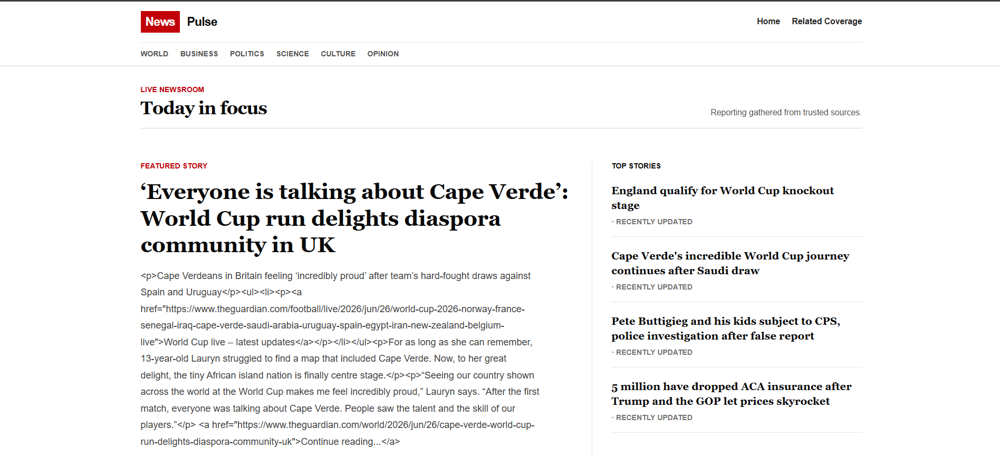
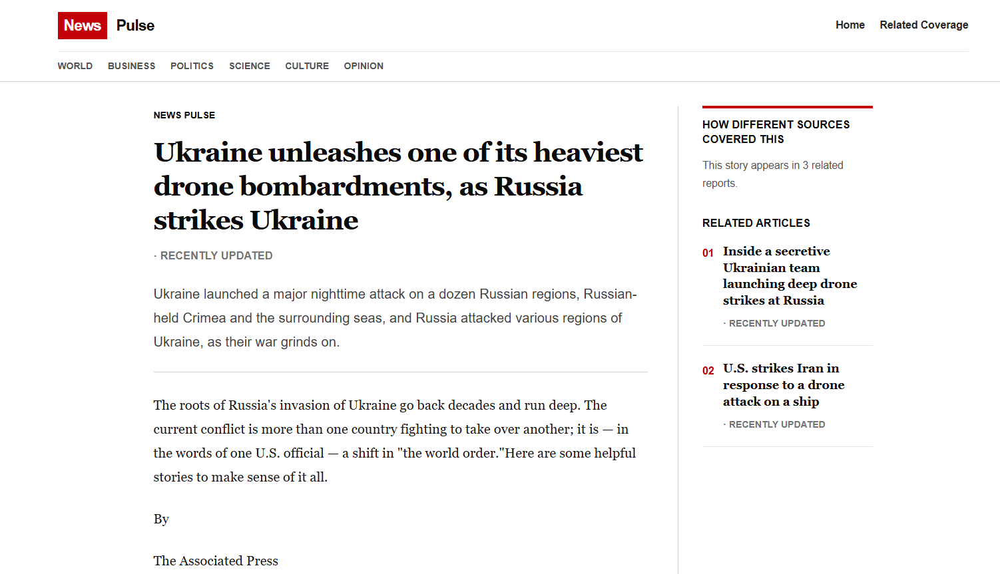
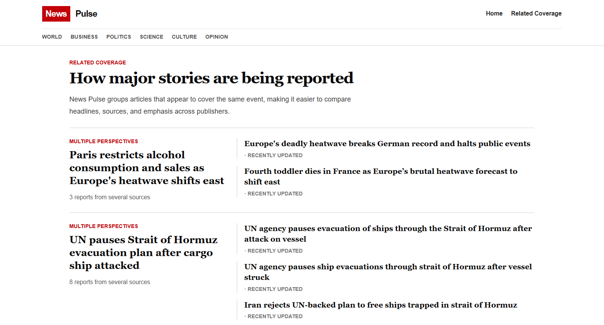
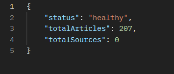

# News Pulse

A multi-source news aggregation and clustering platform that collects articles from various news organizations, extracts their content, groups related stories together, and presents them through a clean news-oriented interface.

The project demonstrates a complete data pipeline involving scraping, processing, storage, clustering, backend APIs, and frontend rendering.

---

## Project Overview

News Pulse collects articles from multiple RSS news feeds such as:

* BBC
* NPR
* The Guardian

The system then:

1. Fetches article metadata from RSS feeds.
2. Extracts the full article content using web scraping.
3. Stores articles in MongoDB.
4. Groups related stories into clusters using a keyword similarity algorithm.
5. Serves data through Express APIs.
6. Displays articles and clusters through a React frontend.

---

## Features

* Multi-source news aggregation
* Full article content extraction
* Duplicate prevention using unique URLs
* Article clustering
* REST API backend
* Clean and minimal news-oriented UI
* MongoDB storage
* Responsive frontend

---

## Project Architecture

```text
RSS Feeds
    ↓
Python Scraper
    ↓
MongoDB
    ↓
Express API
    ↓
React Frontend
```

---

## Tech Stack

### Frontend

* React
* React Router
* Axios
* Tailwind CSS

### Backend

* Node.js
* Express.js
* MongoDB
* Mongoose

### Data Pipeline

* Python
* feedparser
* BeautifulSoup
* requests
* pymongo

---

## Folder Structure

```text
news-pulse/
│
├── backend/
│   ├── controllers/
│   ├── models/
│   ├── routes/
│   └── server.js
│
├── frontend/
│   ├── components/
│   ├── pages/
│   └── services/
│
└── scraper/
    ├── rss_reader.py
    ├── article_parser.py
    ├── clustering.py
    ├── database.py
    └── app.py
```

---

## How the System Works

### 1. Python Scraper

The scraper is responsible for data ingestion.

Responsibilities:

* Fetch RSS feeds
* Parse metadata
* Extract article content
* Save articles into MongoDB
* Generate clusters
* Assign cluster IDs

Run using:

```bash
python app.py
```

---

### 2. MongoDB

MongoDB acts as the central data store.

It stores:

* Article title
* Summary
* Full content
* Source
* Publication date
* URL
* Cluster ID

---

### 3. Express Backend

The backend exposes APIs that are consumed by the frontend.

Available endpoints:

```text
GET /api/articles
GET /api/articles/:id
GET /api/clusters
GET /api/status
```

Start using:

```bash
npm run dev
```

or

```bash
node server.js
```

---

### 4. React Frontend

The frontend consumes backend APIs and displays articles in a clean news-oriented layout.

Responsibilities:

* Display articles
* Display clusters
* Show article details
* Handle navigation

Start using:

```bash
npm run dev
```

---

## Local Setup

### Clone Repository

```bash
git clone <repository-url>
cd news-pulse
```

### Backend

```bash
cd backend
npm install
npm run dev
```

### Frontend

```bash
cd frontend
npm install
npm run dev
```

### Scraper

```bash
cd scraper

python -m venv venv

venv\Scripts\activate

pip install -r requirements.txt

python app.py
```

---

## Environment Variables

### Backend

Create a `.env` file inside the backend folder.

```env
MONGO_URI=your_mongodb_connection_string
PORT=5000
```

### Scraper

Create a `.env` file inside the scraper folder.

```env
MONGO_URI=your_mongodb_connection_string
```

---

## Screenshots

### Homepage



---

### Article Page



---

### Clustering View



---

### API Status



---

## Future Improvements

* Automatic scheduled scraping
* Search functionality
* Category filtering
* User bookmarks
* Personalized news feed
* Better clustering using NLP models

---

## Author

Harshit Bhardwaj

Computer Science Engineering Student | Full Stack Developer
